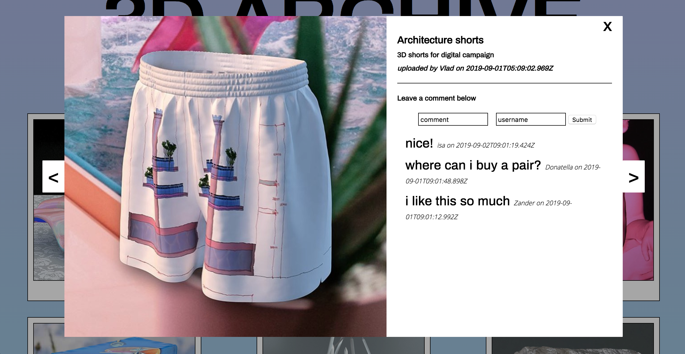

# 3D Archive

3D Archive is a single page application where users can upload their own 3D artworks, check other people's works and comment on them. Built with Vue.js and AWS / S3.

## Tech Stack

- HTML, CSS, Javascript
- Node.js
- Vue.js
- Express
- AWS / S3
- PostgreSQL

## Features

- add new images: title, description, username and file
- image modal with info about the artwork
- leave comments on images: add comment + username
- close image modal
- previous/next image buttons
- show more images button

